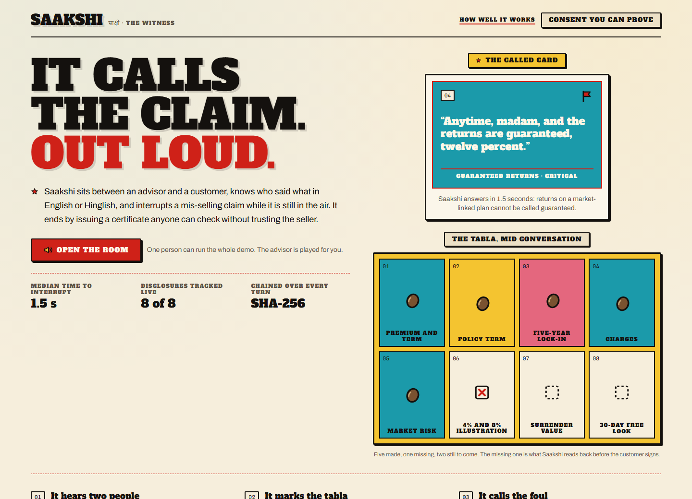
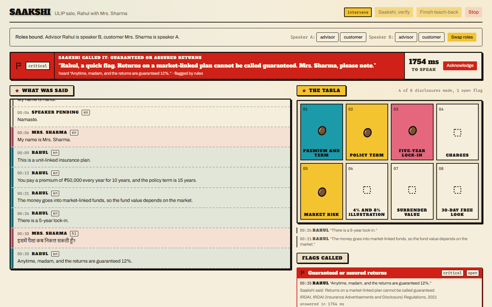
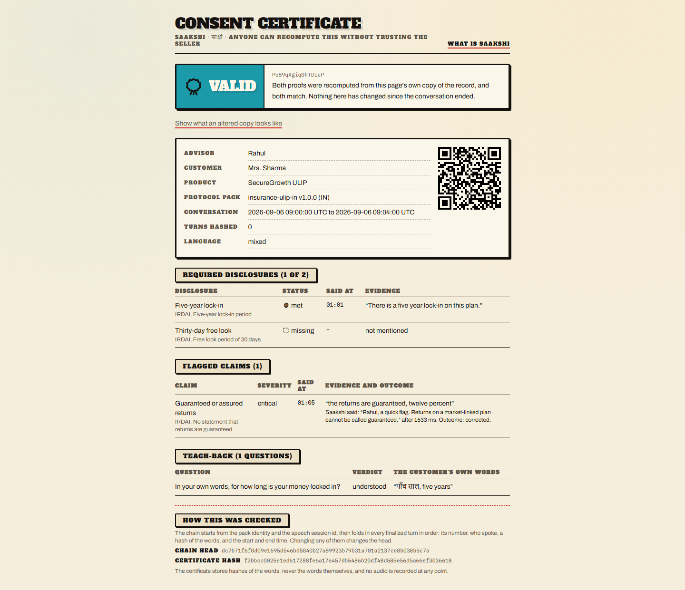
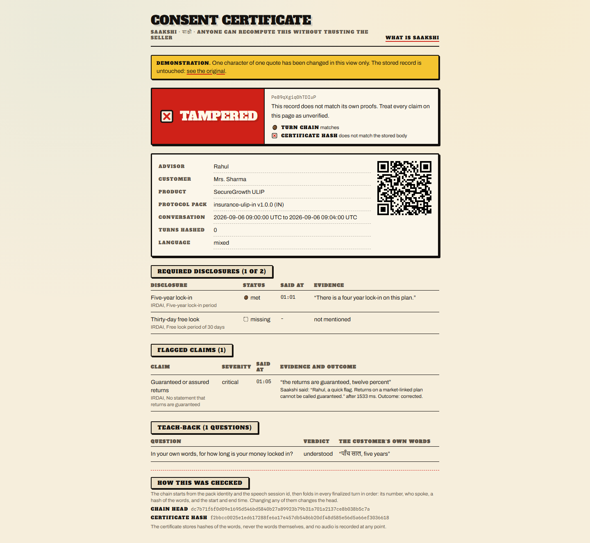
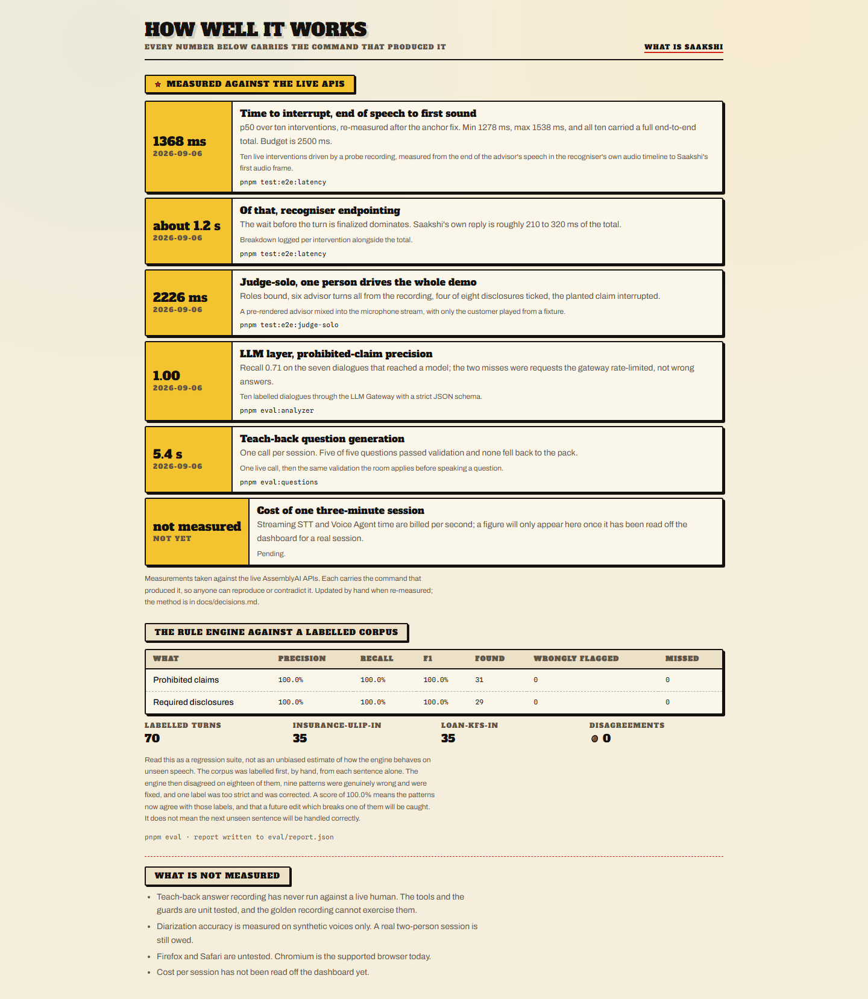
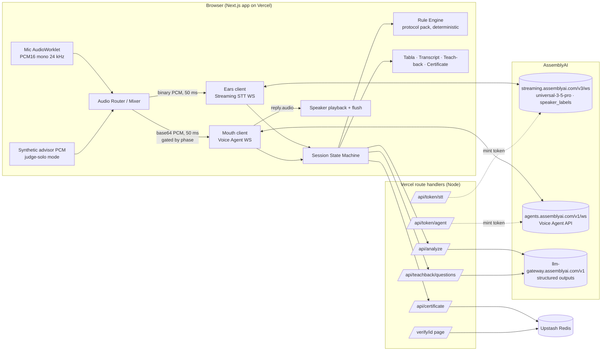

<div align="center">



# Saakshi

**Consent you can prove.**

An AI witness for regulated sales conversations. It knows who said what in English or Hinglish,
interrupts a mis-selling claim while it is still in the air, checks that the customer actually
understood, and issues a certificate anyone can verify without trusting the seller.

[**Open the live demo →**](https://saakshi-1.vercel.app) · [How well it works](https://saakshi-1.vercel.app/metrics) · MIT licensed

Built on AssemblyAI Streaming STT (Universal-3.5 Pro, diarized), the Voice Agent API, and the LLM
Gateway, for the lablab.ai x AssemblyAI Voice Agent Hackathon, September 2026.

</div>

---

## The moment it exists for

An advisor says *"Anytime, madam, and the returns are guaranteed, twelve percent."*
**Under two seconds later**, from the end of that sentence to Saakshi's first sound, she says it out
loud: *"Rahul, a quick flag. Returns on a market-linked plan cannot be called guaranteed."*



Everything on that screen is real: the transcript is live diarized speech in two scripts, the tabla
on the right is the regulator's disclosure list filling as they are actually made, and the number in
the banner is measured end to end, recogniser lag included.

## How it works

Saakshi is a called game. Every disclosure the regulator requires is a named, numbered card, and it
gets a bean the moment it is genuinely said, with the quote and the clock time that prove it.

**1. It hears two people.** Streaming STT with speaker labels tells the advisor from the customer,
in English, in Hindi, or in a sentence that switches halfway. Roles bind from the spoken names, in
either script.

**2. It marks the tabla.** A versioned protocol pack is evaluated deterministically on every
finalized turn. An LLM layer reads the same turns and leaves notes for a reviewer; it can never tick
a card, flag a claim or speak. Two packs ship today, and the start screen switches between them:

| Pack | Regulator | Catches |
|---|---|---|
| `insurance-ulip-in` | IRDAI | Guaranteed returns, "it is like an FD", no charges, withdraw anytime, tax free forever, pressure |
| `loan-kfs-in` | RBI Key Facts Statement | No-cost EMI, guaranteed approval, "no hidden charges" with no APR given, compulsory insurance, "your CIBIL is safe", pressure |

Each has eight required disclosures with their citation, six prohibited claims with the correction
Saakshi speaks, teach-back topics, and its own demo script and synthetic advisor. Adding a third is
a JSON file and a rendered voice, not a code change.

**3. It calls the foul.** A confirmed critical claim goes to the Voice Agent as a scripted
correction, under twenty words, spoken over the conversation.

**4. It checks she understood.** At the end, Saakshi asks three to five teach-back questions built
from what was actually said, listens to the answers in Hinglish, re-explains once where she was
only partly right, and records a verdict per question.

**5. It issues proof.** Every finalized turn is hash-chained in the browser; the server recomputes
the chain and the certificate hash before storing, and refuses anything that does not verify.

## The proof

The certificate stores hashes of the words, never the words themselves, and no audio is recorded at
any point. Anyone can recompute both proofs from the stored record alone.

| Verified | One character changed |
|---|---|
|  |  |

## Measured, not claimed

Every number here was produced by a live run against the real APIs. The method for each is in
[`docs/decisions.md`](docs/decisions.md).

| What | Result | How |
|---|---|---|
| Time to interrupt, end of speech to first sound | **p50 1368 ms, max 1538 ms** | 10 interventions, `pnpm test:e2e:latency` |
| Prohibited-claim detection precision | **1.00** | 10 labelled dialogues, `pnpm eval:analyzer` |
| Disclosures caught on one pass of the demo script | **7 to 8 of 8** | identity-only vocabulary, `pnpm test:e2e:golden`, `pnpm test:e2e:keyterms` |
| Disclosures ticked that were never made | **0 of 12** | omitted-disclosures recording, three vocabulary modes, `pnpm test:e2e:keyterms` |
| Cost of one demo session | **about $0.16** | billed seconds at list prices, `pnpm test:e2e:keyterms` |
| Teach-back question generation | **5.4 s, once per session** | `pnpm eval:questions` |
| Judge-solo, whole demo driven by one person | **interrupts at 2226 ms** | `pnpm test:e2e:judge-solo` |
| Rule engine against 70 labelled turns | **precision 1.00, recall 1.00** | `pnpm eval`, and read the caveat below |
| Unit tests | **418 passing** | `pnpm test` |

Latency is reported honestly: the badge shows the recogniser's endpointing lag plus Saakshi's own
reaction, and says **reply only** when the end-to-end total cannot be computed.

The corpus score is a **regression suite, not a generalisation estimate**. The 70 turns were
labelled by hand from each sentence alone, the engine then disagreed on eighteen of them, nine
patterns were genuinely wrong and were fixed, and one label was too strict and was corrected. It
means a future edit that breaks one of those cases will be caught. It does not mean the next unseen
sentence will be handled correctly. The product says the same thing on its own metrics page.



## Judge-solo mode

You do not need two people. Judge-solo plays a pre-rendered advisor into the same microphone stream
the recogniser hears, so diarization finds two speakers and you only have to play the customer. The
panel tells you what to say next, including the Hinglish lines. It is on by default; turn it off on
the start screen when two people are actually in the room.

The synthetic advisor is never sent to the Voice Agent, and it waits for a quiet moment before each
line so it does not talk over you.

## Architecture



The API key never reaches the browser: both sockets are opened with single-use tokens minted
server-side and valid for sixty seconds.

What the certificate proves, what it does not, and the threats considered:
[`docs/ARCHITECTURE.md`](docs/ARCHITECTURE.md).

## Using the AssemblyAI APIs

Things this build had to get right, each verified against the docs and recorded with evidence in
[`docs/decisions.md`](docs/decisions.md):

- **Streaming STT** at 24 kHz PCM16, `speaker_labels`, `max_speakers=2`, `language_codes` as a
  JSON-array parameter, `format_turns=true`, keyterms from the room's own names and product terms.
  `SpeakerRevision` only fills PENDING turns, after it was measured mislabelling settled ones.
- **Voice Agent** with `session.update` for the mutable fields, scripted `reply.create` for every
  spoken line (verbatim in 10 of 10 trials), playback flushed on `input.speech.started`, and
  `session.end` before an intentional close.
- **Client-side tools** with results held until `reply.done` is the latest event, which is what the
  docs require, plus the documented hold-mode exception for `finish_teachback`.
- **Progressive tool reveal**: `finish_teachback` appears only after three answers are recorded, and
  the prompt changes in the same message.
- **LLM Gateway** with strict JSON schema where the model supports it, falling back to a
  prompt-described shape with `json-repair` where it does not. Its findings are advisory notes:
  they never tick a card, flag a claim or get spoken.
- **Keyterms that cannot manufacture evidence.** Names, product and regulator reach the recogniser;
  the disclosure and claim phrases the rules listen for do not. A unit test proves no identity term
  can complete a rule on its own, and a live run on identical audio showed no lost recall.

## What we learned about the AssemblyAI API

Each of these cost an hour or a day and is recorded with its evidence in
[`docs/decisions.md`](docs/decisions.md):

- **Biasing the recogniser toward the answer key manufactures evidence.** Keyterms improve
  recognition of the words you list, so listing the phrases your rules match lets a mishearing snap
  to a disclosure nobody made. We split the vocabulary and measured: identity-only terms kept 8 of
  8 disclosures on the demo script.
- **`SpeakerRevision` can be wrong on synthetic voices.** The end-of-session refinement moved five
  of eight settled turns to the other speaker, including two disclosures. It now only fills turns
  the live pass left `PENDING`.
- **`conversation.message` is not read by the next `reply.create`.** A `system_prompt` appendix is.
  Every spoken line is therefore scripted through `reply.create` instructions (verbatim in 10 of 10
  trials), and the teach-back context goes into the prompt.
- **Two official pages disagree on `tool.result` timing.** The client-side-tools page says hold the
  result until `reply.done` is the latest event, and to drop pending results on an interrupted
  reply; the docs-map prompt says send at once. We follow the tools page, with the documented
  hold-mode exception where the result itself fires the next reply.
- **`speaker_labels` swaps the turn profile.** With diarization on, `mode` is ignored, turns
  force-finalize at 10 s and partials slow to about 3 s unless `continuous_partials=true`;
  `format_turns` defaults to false, so `turn_is_formatted` never flips without it.
- **`language_codes` and `keyterms_prompt` travel as JSON-array strings**, not repeated query
  parameters. `Turn.language_code` is a hint, not a gate: short English turns arrived tagged `et`.
- **A small model at 0.8 confidence is not a witness.** The one gateway model this account reaches
  flagged a truthful sentence as a prohibited claim one turn after the lock-in was disclosed. The
  analyzer became advisory the same day.
- **The phase flips before the sockets close.** `Terminate` and `session.end` are answered after
  the room reports DONE, so billing has to be read from the closing events, not the phase.

## Run it yourself

```bash
pnpm install
cp .env.example .env.local   # fill ASSEMBLYAI_API_KEY
pnpm dev                     # http://localhost:3000, allow the microphone on /session
```

Checks that need no API key:

```bash
pnpm test                    # 418 unit tests
pnpm eval                    # rule engine against the labelled corpus, writes eval/report.json
pnpm packs:validate          # every protocol pack parses and compiles
pnpm test:e2e                # smoke and certificate verification, fake mic
pnpm lint && pnpm typecheck && pnpm build
```

Live checks against AssemblyAI (need the key, cost a few cents):

```bash
pnpm demo:render             # pre-render the synthetic advisor for judge-solo
pnpm demo:render loan-kfs-in # the same for the loan pack
pnpm fixtures:wav            # two-voice WAV of the demo script
pnpm fixtures:wav:customer   # customer-only WAV for judge-solo
pnpm fixtures:wav:omitted    # four disclosures missing, acoustic neighbours spoken
pnpm test:e2e:live           # both sockets open
pnpm test:e2e:golden         # the whole path, to a certificate that verifies
pnpm test:e2e:judge-solo     # one person drives the entire demo
pnpm test:e2e:latency        # interruption latency over ten samples
pnpm eval:analyzer           # detection accuracy over ten labelled dialogues
pnpm eval:questions          # teach-back question quality, one live call
SAAKSHI_KEYTERMS_MODE=identity SAAKSHI_FAKE_WAV=tests/fixtures/omitted-draft.wav pnpm test:e2e:keyterms
                             # what the board ticks under one recogniser vocabulary
```

## Repository

| Path | What is in it |
|---|---|
| `packs/` | Protocol packs: checkpoints, prohibited claims, citations, teach-back topics, demo script |
| `eval/` | The labelled corpus, the generated report, and the live measurements the metrics page reads |
| `lib/aai/` | Typed Streaming STT and Voice Agent clients, token minting, message schemas |
| `lib/session/` | Phase machine, transcript, role calibration, rule fusion, teach-back, judge-solo |
| `lib/cert/` | Canonical JSON, the hash chain, the certificate builder and store |
| `lib/demo/` | The synthetic advisor |
| `lib/eval/` | Corpus loading and the precision and recall arithmetic |
| `docs/ARCHITECTURE.md` | What runs where, what the certificate proves and does not, the threat model |
| `docs/decisions.md` | Every verified API fact, spike result and measurement, with its method |
| `docs/deployment.md` | How this is deployed, and the environment it needs |
| `tests/` | Unit tests, the golden live end to end run, and the video capture harness |

## Deployment

See [`docs/deployment.md`](docs/deployment.md) for the Vercel setup, environment variables, Upstash,
and the post-deploy verification steps.

## Licence

MIT.
