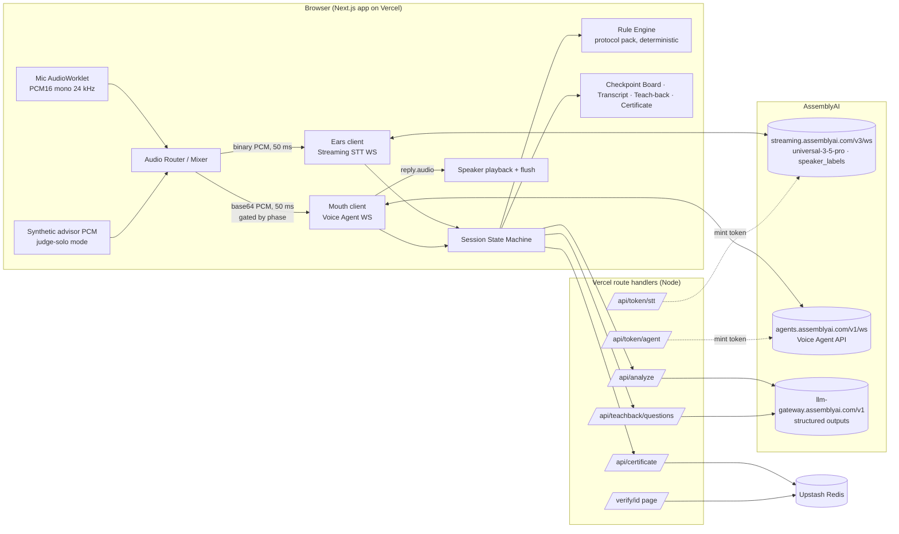

# Saakshi

**Consent you can prove.**

Saakshi is an AI witness that sits in on regulated sales conversations, knows who said what in English or Hinglish, speaks up within two seconds when a customer is about to be misled, runs a teach-back with the customer, and ends by issuing a hash-chained Consent Certificate that anyone can verify. It uses AssemblyAI Streaming STT (Universal-3.5 Pro, diarized) as its ears, the Voice Agent API as its mouth, and the LLM Gateway for structured analysis. Built for the lablab.ai x AssemblyAI Voice Agent Hackathon, September 2026.

## Architecture



## Setup

```bash
pnpm install
cp .env.example .env.local   # fill ASSEMBLYAI_API_KEY
pnpm dev                     # http://localhost:3000
pnpm test                    # vitest unit tests
pnpm test:e2e                # playwright with a fake mic
pnpm lint && pnpm typecheck && pnpm build
```

## Status

Phase 0 (bootstrap and spikes), 2026-09-05. Both AssemblyAI sessions run from the browser: Streaming STT
(Universal-3.5 Pro, diarized, English and Hindi) as the ears and the Voice Agent API as the mouth, with
server-minted single-use tokens. Spike results and every verified payload shape are in
`docs/decisions.md`; recorded fixtures are in `tests/fixtures/`.

Live checks against AssemblyAI (need `ASSEMBLYAI_API_KEY` in `.env`, cost a few cents):

```bash
pnpm test:e2e:live                                   # both sockets with Chromium fake mic
pnpm fixtures:wav                                    # two-voice WAV from the demo script (Windows voices)
SAAKSHI_LIVE_E2E=1 SAAKSHI_FAKE_WAV=tests/fixtures/golden-draft.wav SAAKSHI_LIVE_HOLD_MS=90000 pnpm exec playwright test tests/e2e/dual-session.live.spec.ts   # diarized turns, then pnpm fixtures:split
node scripts/spike-agent-context.mjs 300000          # Voice Agent context and idle spikes, headless
```

## Licence

MIT.
