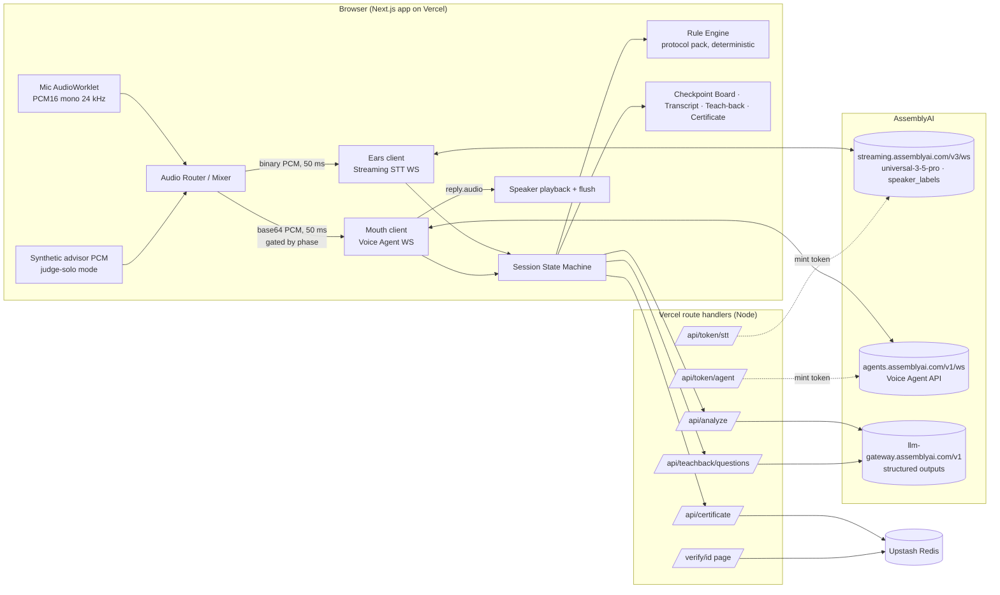
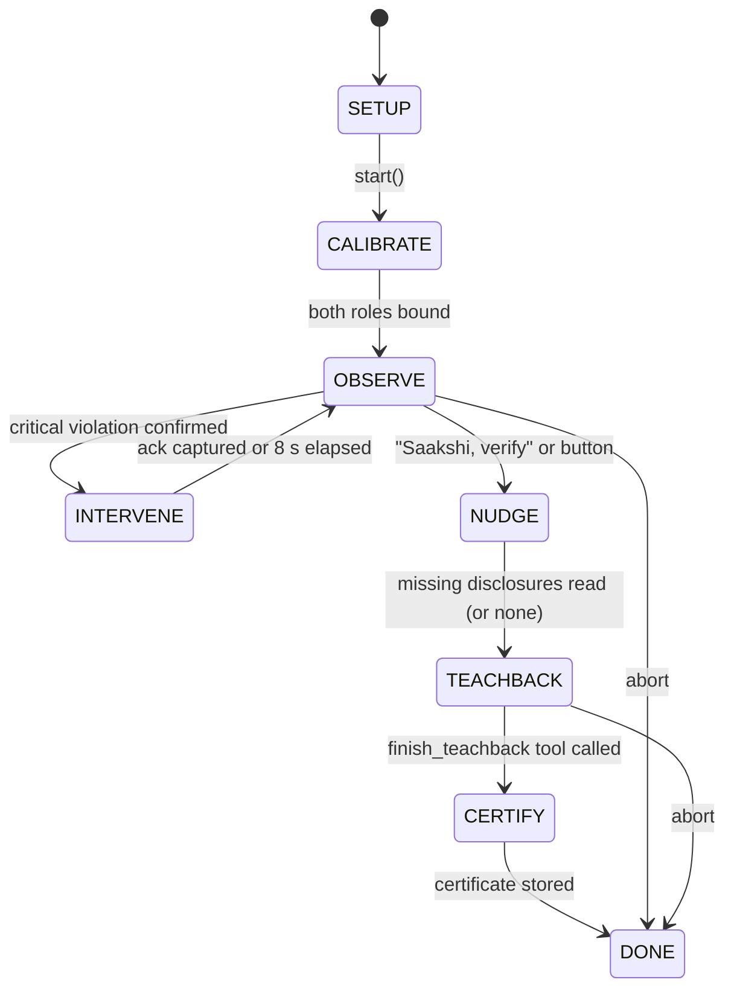

# Saakshi — Technical Requirements & Design (TRD)

Version 1.0, 2026-09-05. Companion to `prd.md`. Read `docs/assemblyai-voice-agent-gotchas.md` before touching any audio or WebSocket code. **The AssemblyAI docs are the source of truth**; when a field or payload is not in this document, fetch the docs page (MCP server `assemblyai-docs` or WebFetch) instead of guessing.

---

## 1. Architecture



**Why this shape.** Vercel functions cannot hold WebSockets, so the browser talks to AssemblyAI directly using short-lived tokens (the documented pattern). The **Ears** session hears the whole room with diarization. The **Mouth** session is the agent's voice and its own ears during the phases when it must converse; the rest of the time it receives the room as injected text context. A client-side state machine owns the phase and decides which audio goes where.

---

## 2. Session state machine



| Phase | Mic → STT | Mic → Voice Agent | Voice Agent system prompt | Tools exposed |
|---|---|---|---|---|
| SETUP | off | off | none (session not open) | none |
| CALIBRATE | on | off (agent speaks greeting only) | `prompts/calibrate` | none |
| OBSERVE | on | **off** (context via `conversation.message`) | `prompts/observer` | none |
| INTERVENE | on | on for ≤ 8 s | `prompts/observer` + `reply.create` instructions | `ack_intervention` (interactive) |
| NUDGE | on | off | `prompts/observer` + `reply.create` | none |
| TEACHBACK | on | **on** | `prompts/teachback` | `record_answer`, `reexplain`; `finish_teachback` after ≥ 3 answers |
| CERTIFY | off | off | n/a | none |

Implementation: a small explicit reducer (`lib/session/machine.ts`) with typed events. Unit-test every transition. XState is acceptable but not required.

---

## 3. Audio pipeline

### 3.1 Capture

```js
navigator.mediaDevices.getUserMedia({
  audio: { echoCancellation: true, noiseSuppression: false, autoGainControl: true }
});
```

- Chromium: `new AudioContext({ sampleRate: 24000 })` so both AssemblyAI sessions get native 24 kHz PCM16 with no resampling. Send `sample_rate=24000` on the STT URL (spec allows 8000–96000).
- Firefox/Safari: default-rate context, resample to 24 kHz in the AudioWorklet (see gotchas file).
- Worklet emits Int16 frames of ~50 ms (1200 samples at 24 kHz = 2400 bytes).

### 3.2 Router

`lib/audio/router.ts` receives each 50 ms frame and:

1. Always forwards to Ears as a **binary** WebSocket frame (raw bytes, no JSON, no base64).
2. Forwards to Mouth as `{ "type": "input.audio", "audio": "<base64>" }` **only** when `gate.mouth === true` (INTERVENE ack window, TEACHBACK).
3. In judge-solo mode, mixes the synthetic advisor frame (Int16 add with clipping) into the frame sent to Ears, and plays the synthetic frame to the speakers. Synthetic audio is **never** sent to Mouth.

Never send faster than real time to the Voice Agent (frames beyond ~1 s of audio per wall-clock second are dropped).

### 3.3 Playback and flush

Use the reference `playReplyAudio` / `flushPlayback` from the gotchas file. Flush on `input.speech.started` and on `reply.done` with `status: "interrupted"`.

---

## 4. Ears: Streaming STT client (`lib/aai/ears.ts`)

**Token.** `GET /api/token/stt` → server calls `GET https://streaming.assemblyai.com/v3/token?expires_in_seconds=60&max_session_duration_seconds=3600` with header `Authorization: <API_KEY>`; returns `{ token, expires_in_seconds }`. Mint immediately before connecting.

**URL.**
```
wss://streaming.assemblyai.com/v3/ws
  ?token=<token>
  &speech_model=universal-3-5-pro
  &encoding=pcm_s16le
  &sample_rate=24000
  &speaker_labels=true
  &max_speakers=2
  &language_codes=en&language_codes=hi     (verify array encoding on day 1; fall back to omitting for full multilingual)
  &language_detection=true
  &voice_focus=far-field
  &mode=balanced
  &prompt=<≤1750 chars scenario text>
  &keyterms_prompt=<term>&keyterms_prompt=<term>...   (≤100 terms, ≤50 chars each)
  &session_heartbeat=true
```

**Server messages handled.**

| Type | Handling |
|---|---|
| `Begin` | store session id, expires_at; mark Ears ready |
| `Turn` (`end_of_turn=false`) | render partial for that `turn_order`; ignore for analysis |
| `Turn` (`end_of_turn=true`, `turn_is_formatted=true`) | finalize turn: `{turn_order, speaker_label, transcript, language_code, language_confidence, end_of_turn_confidence, words[{text,start,end,confidence,speaker}]}`; append to hash chain; run rule engine; enqueue for LLM analyzer; inject to Mouth as context (OBSERVE) |
| `Turn` with `speaker_label = "PENDING"` | keep provisional; resolve on next message for same turn or on revision |
| `SpeakerRevision` | apply revised labels to stored turns; re-run role mapping; mark certificate rows "revised" |
| `Heartbeat` | update liveness indicator |
| `Termination` | close; keep reading until received |

**Client messages.** Binary audio; `UpdateConfiguration` for `keyterms_prompt`, `prompt`, `agent_context` (send the agent's spoken text after each Saakshi reply so STT has conversational context); `ForceEndpoint` when the user clicks "Verify"; `Terminate` on exit; `KeepAlive` if idle.

**Role mapping.** `roles: Record<SpeakerLabel, "advisor" | "customer">` set during CALIBRATE: the first finalized turn after "Advisor, please say your name" binds its label to advisor; the next distinct label binds to customer. If both prompts resolve to the same label, ask again once, then fall back to manual assignment. "Swap roles" flips the map and re-renders.

**Reconnect.** On unexpected close, mint a new token and reconnect with the same params; STT context is per-session, so record a `gap` event with timestamps into the certificate.

---

## 5. Mouth: Voice Agent client (`lib/aai/mouth.ts`)

**Token.** `GET /api/token/agent` → server calls `GET https://agents.assemblyai.com/v1/token?expires_in_seconds=60&max_session_duration_seconds=3600`; returns `{ token }`. Single use; mint right before connecting.

**Connect.** `wss://agents.assemblyai.com/v1/ws?token=<token>` then immediately:

```json
{
  "type": "session.update",
  "session": {
    "system_prompt": "<prompts/calibrate>",
    "greeting": "I am Saakshi. I will listen quietly and make sure everything important is covered. Rahul, please say your name.",
    "input": {
      "format": { "encoding": "audio/pcm", "sample_rate": 24000 },
      "keyterms": ["Rahul", "Sharma", "ULIP", "lock-in", "free look", "surrender value", "fund value", "premium allocation charge"],
      "language_codes": ["en", "hi"],
      "voice_focus": "far-field",
      "turn_detection": { "vad_threshold": 0.5, "min_silence": 1400, "max_silence": 4000, "interrupt_response": true }
    },
    "output": { "voice": "anna", "format": { "encoding": "audio/pcm", "sample_rate": 24000 }, "volume": 100 },
    "tools": []
  }
}
```

Wait for `session.ready` (save `session_id` for `session.resume`). Do not send `input.audio` before it. `greeting` and `output.voice` are immutable afterwards; `system_prompt`, `tools`, `input.keyterms`, `input.turn_detection`, `input.transcription_prompt`, `output.volume` are mutable via further `session.update`.

**Voice.** Default `anna` (UK English, calm). Evaluate `jane`, `mary`, `vera` by ear in week one and record the choice in the decisions log.

**Context injection (OBSERVE).** For each finalized Ears turn:

```json
{ "type": "conversation.message", "role": "system",
  "content": "[ADVISOR 00:41] Returns are guaranteed, twelve percent, better than any FD." }
```

Batch at most one message per finalized turn; include the role tag and mm:ss so the agent can cite it. Do not expect a reply; the agent replies only on `reply.create`.

**Intervention (INTERVENE).**

```json
{ "type": "reply.create",
  "instructions": "Say exactly this, calmly, in one breath, then stop: 'Rahul, a quick flag. Returns on a market-linked plan cannot be called guaranteed, and this plan has a five-year lock-in. Mrs. Sharma, please note both.'" }
```

Open the mic gate to Mouth for ≤ 8 s with the tool `ack_intervention` exposed (`{acknowledged: boolean, note: string}`), then close the gate and remove the tool. Record `{violation_id, quote, turn_order, spoken_text, latency_ms, acknowledged}`.

**Nudge (NUDGE).** Same mechanism with the list of missing checkpoints in a single sentence.

**Teach-back (TEACHBACK).**

1. `session.update` with `system_prompt = prompts/teachback(questions, product, names)` and `tools = [record_answer, reexplain]`.
2. Open the mic gate permanently for this phase.
3. `reply.create` with instructions to ask question 1.
4. After each `transcript.agent` ending in `?`, raise thresholds: `min_silence: 2200, max_silence: 6000`; revert on the next `transcript.user`.
5. On `tool.call record_answer` → validate against the question list, store `{question_id, verdict, customer_quote, turn_order}`, reply `tool.result` immediately with `JSON.stringify({ok:true, remaining:n})`.
6. When ≥ 3 answers recorded, `session.update` adding `finish_teachback` (`execution_mode: "hold"`) and appending one line to the prompt: "When all questions are answered, call finish_teachback."
7. On `tool.call finish_teachback` → build the certificate (may take > 5 s, hence `hold`), reply `tool.result` with the certificate id; the agent's auto-reply tells the customer the certificate is ready.
8. If Ears attributes a finalized turn during TEACHBACK to the advisor, inject: `conversation.message` role system: "The advisor, not the customer, just spoke. Politely ask the customer to answer in their own words."

**Tool schemas.**

```json
[
  { "name": "record_answer",
    "description": "Record the customer's answer to the current teach-back question. Call once per question, right after the customer answers, before saying anything else.",
    "parameters": { "type": "object", "properties": {
      "question_id": { "type": "string", "enum": ["q1","q2","q3","q4","q5"] },
      "verdict": { "type": "string", "enum": ["understood","partial","not_understood"] },
      "customer_quote": { "type": "string", "description": "The customer's words, verbatim, in the language they used. e.g. 'paanch saal tak lock rahega'" } },
      "required": ["question_id","verdict","customer_quote"] },
    "execution_mode": "interactive", "timeout_seconds": 10 },
  { "name": "reexplain",
    "description": "Log that you are re-explaining a topic after a partial or wrong answer. Call before re-explaining. Use at most once per question.",
    "parameters": { "type": "object", "properties": {
      "question_id": { "type": "string", "enum": ["q1","q2","q3","q4","q5"] },
      "topic": { "type": "string", "enum": ["lock_in","charges","market_risk","free_look","premium_term","surrender_value","benefit_illustration"] } },
      "required": ["question_id","topic"] },
    "execution_mode": "interactive", "timeout_seconds": 10 },
  { "name": "finish_teachback",
    "description": "Finish the teach-back and generate the Consent Certificate. Call only after every question has a recorded answer.",
    "parameters": { "type": "object", "properties": { "summary": { "type": "string", "description": "One sentence on overall understanding." } }, "required": ["summary"] },
    "execution_mode": "hold", "timeout_seconds": 60 }
]
```

`tool.result.result` must be a JSON **string**. Always echo `call_id`. Send the result the moment the tool returns.

**Events consumed.** `session.ready`, `session.updated`, `session.error`, `input.speech.started` (flush), `input.speech.stopped`, `transcript.user.delta`, `transcript.user`, `reply.started`, `reply.audio` (play), `transcript.agent.delta` (captions with `start_ms`/`end_ms`), `transcript.agent` (`interrupted` flag; question detection), `reply.done` (interrupted → flush), `tool.call`, `session.ended`.

**Lifecycle.** Open the Voice Agent session lazily at CALIBRATE (billing starts then). Always send `session.end` on intentional exit. On unintentional drop during TEACHBACK, reconnect within 30 s and send `{ "type": "session.resume", "session_id": "<saved>" }`; log a `gap` into the certificate.

---

## 6. Analyzer

### 6.1 Layer 1: deterministic rule engine (`lib/rules/engine.ts`)

Runs in the browser on every finalized turn, < 50 ms. Pure functions, fully unit-tested.

```ts
type Pack = {
  id: string; version: string; title: string; jurisdiction: "IN" | "UK";
  keyterms: string[];               // seeds STT + Voice Agent keyterms
  scenario_prompt: string;          // STT `prompt` (≤1750 chars)
  checkpoints: Checkpoint[];
  prohibited: Prohibited[];
  teachback_topics: TeachbackTopic[];
  demo_script: DemoLine[];          // judge-solo synthetic advisor
};
type Checkpoint = { id: string; label: string; required_speaker: "advisor";
  patterns: string[];               // regex source, case-insensitive, Devanagari + Roman Hindi + English
  citation: Citation; hint: string };
type Prohibited = { id: string; label: string; severity: "critical" | "high" | "medium";
  patterns: string[]; citation: Citation; correction: string /* ≤20 words, spoken */ };
type Citation = { authority: string; instrument: string; clause: string; url?: string };
```

Matching: normalise transcript (NFC, lower-case, collapse spaces, strip punctuation), test each pattern against the whole turn transcript **and** against a sliding two-turn window for split sentences. A checkpoint ticks only from an advisor turn. A prohibited match on a customer turn is recorded as "customer belief" but never triggers an intervention.

Insurance pack v1 (`packs/insurance-ulip-in.json`) minimum content:

| Checkpoint | Example patterns | Citation |
|---|---|---|
| premium_and_term | `premium`, `प्रीमियम`, `pay(ing)? for \d+ years`, `saal tak` | IRDAI PPI Regs 2024 (customised benefit illustration) |
| policy_term | `policy term`, `\d+ (year|saal) (policy|plan)` | same |
| lock_in_5y | `lock[- ]?in`, `five years|5 years|paanch saal|पाँच साल` | IRDAI ULIP norms (5-year lock-in) |
| charges | `charge`, `allocation`, `fund management`, `mortality`, `शुल्क` | IRDAI Master Circular on Life Insurance Products (Jun 2024) |
| market_risk | `market[- ]linked`, `depends on (the )?market`, `NAV`, `बाज़ार` | same |
| benefit_illustration_4_8 | `illustration`, `4 ?(%|percent)`, `8 ?(%|percent)` | IRDAI PPI Regs 2024 |
| surrender_value | `surrender`, `discontinu` | Master Circular |
| free_look_30 | `free[- ]look`, `thirty days|30 days|tees din|तीस दिन` | IRDAI PPI Regs 2024 (30-day free look) |

| Prohibited | Severity | Example patterns | Correction (spoken) |
|---|---|---|---|
| guaranteed_returns | critical | `guaranteed? (return|income|12|10)`, `assured return`, `pakka return`, `गारंटी` | "Returns on a market-linked plan cannot be called guaranteed." |
| like_fd | high | `like (an? )?FD`, `same as (a )?fixed deposit`, `FD jaisa` | "This is not a fixed deposit; the value can go down." |
| no_charges | high | `no charges`, `zero charges`, `koi charge nahi` | "This plan has charges; they are listed in the benefit illustration." |
| withdraw_anytime | critical | `withdraw anytime`, `kabhi bhi nikal`, `no lock` | "There is a five-year lock-in on this plan." |
| tax_free_forever | medium | `completely tax[- ]free`, `never (any )?tax` | "Tax treatment depends on current law and your situation." |
| pressure | medium | `only today`, `offer ends`, `sign (now|today)`, `abhi sign` | "Mrs. Sharma, you have a thirty-day free-look period; there is no rush." |

Loan pack (`packs/loan-kfs-in.json`, P1): APR, tenure and EMI, fixed vs floating, all fees in KFS, prepayment and foreclosure charges, "nothing outside the KFS can be charged", cooling-off if applicable. Prohibited: "no hidden charges" without KFS, "rate will never change" on floating, "guaranteed approval".

### 6.2 Layer 2: LLM analyzer (`app/api/analyze/route.ts`)

Called after every finalized **advisor** turn (debounced 300 ms) with the last 8 turns as context. LLM Gateway, OpenAI-compatible:

```http
POST https://llm-gateway.assemblyai.com/v1/chat/completions
Authorization: <API_KEY>
{
  "model": "gemini-3.5-flash-lite",
  "messages": [{ "role": "system", "content": "<prompts/analyzer>" },
               { "role": "user", "content": "<pack summary + JSON of last 8 turns with roles and times>" }],
  "response_format": { "type": "json_schema", "json_schema": { "name": "analysis", "strict": true, "schema": { ...AnalysisSchema } } },
  "post_processing_steps": [{ "type": "json-repair" }],
  "max_tokens": 600
}
```

```ts
const AnalysisSchema = z.object({
  checkpoints_satisfied: z.array(z.object({ id: z.string(), turn_order: z.number(), quote: z.string(), confidence: z.number().min(0).max(1) })),
  violations: z.array(z.object({ id: z.string(), turn_order: z.number(), quote: z.string(), severity: z.enum(["critical","high","medium"]), confidence: z.number(), rationale: z.string().max(200) })),
  customer_questions_unanswered: z.array(z.object({ turn_order: z.number(), quote: z.string(), topic: z.string() })),
  language_mix: z.enum(["en","hi","mixed"])
});
```

Rules of the analyzer prompt: only use checkpoint and violation ids from the pack; quote verbatim from the supplied turns; never infer facts not in the transcript; treat Hindi, Hinglish and English as equivalent for meaning; be script-agnostic (Devanagari or Roman).

**Fusion.** A violation becomes an intervention if `(layer1.critical && speaker==advisor)` **or** `(layer2.confidence >= 0.8 && severity in [critical, high] && rateLimit.allows())`. A checkpoint ticks if either layer finds it with confidence ≥ 0.6; the quote shown is the higher-confidence one. Fallback model on 5xx or timeout (2.5 s): `claude-haiku-4-5-20251001`. Optional investigation: the STT WebSocket accepts an `llm_gateway` param that returns `LLMGatewayResponse` per turn; evaluate in Phase 2 as a latency optimisation, do not depend on it.

### 6.3 Teach-back question generator (`app/api/teachback/questions/route.ts`)

Input: pack, checkpoint states, violation list, digest of advisor turns. Output (strict schema): 3–5 questions, each `{id, topic, question_en, expected_points[], hint_hi}` prioritising topics that were flagged or barely covered. Model: `claude-sonnet-4-6` (structured outputs supported). Questions are plain spoken English, ≤ 18 words, no markdown.

---

## 7. Certificate

```ts
type Certificate = {
  id: string;                       // nanoid(16)
  version: "1.0";
  pack: { id: string; version: string; jurisdiction: string };
  parties: { advisor: string; customer: string; organisation?: string };
  product: { name: string; terms?: string[] };
  session: { started_at: string; ended_at: string; stt_session_id: string; agent_session_id: string; gaps: {from:string;to:string}[] };
  checkpoints: { id: string; label: string; status: "met"|"missing"|"met_after_nudge"; evidence?: Evidence; citation: Citation }[];
  violations: { id: string; label: string; severity: string; evidence: Evidence; intervention?: { spoken_text: string; latency_ms: number; acknowledged: boolean }; resolution: "corrected"|"unresolved" }[];
  teachback: { question_id: string; question: string; verdict: string; customer_quote: string; evidence: Evidence; reexplained: boolean }[];
  turns: { turn_order: number; speaker_role: "advisor"|"customer"; transcript_hash: string; start_ms: number; end_ms: number }[];  // minimal digest so the chain is re-verifiable
  turns_digest: { count: number; chain_head: string };   // h_n
  language_mix: string;
  demo: boolean;
  created_at: string;
  certificate_hash: string;         // sha256(canonicalJSON(this with certificate_hash = ""))
};
type Evidence = { turn_order: number; speaker_role: "advisor"|"customer"; start_ms: number; end_ms: number; quote: string; language: string };
```

Hash chain (client-side, `lib/cert/chain.ts`, Web Crypto): `h_0 = sha256(pack.id|pack.version|stt_session_id)`, `transcript_hash_i = sha256(transcript_i)`, `h_i = sha256(h_{i-1}|turn_order|speaker_role|transcript_hash|start_ms|end_ms)`. Fields are joined with `|` as UTF-8 strings; hashes are lower-case hex. Canonical JSON = keys sorted, no whitespace, UTF-8. The server recomputes `certificate_hash` on store and on verify. The verify page re-derives `chain_head` from the `turns` digest list (each entry carries `transcript_hash = sha256(transcript)`, so the chain is computed over hashes and the full transcript never needs to be stored).

Storage: Upstash Redis via Vercel Marketplace, key `cert:<id>`, TTL 90 days. Dev fallback: in-memory Map plus "Download JSON". Verify page: `/verify/[id]` server component, shows VALID or TAMPERED, the evidence table, QR to itself.

---

## 8. Judge-solo synthetic advisor

- Advisor lines come from `pack.demo_script[]` (`{id, text_en, text_display, wait_for: "customer_turn" | "ms:<n>" | "click"}`).
- Audio is pre-rendered once (script `scripts/render-advisor.mjs`): open a throwaway Voice Agent session with voice `george`, send each line via `reply.create` instructions "Say exactly: ...", capture `reply.audio` chunks to `public/demo/advisor/<id>.pcm` (24 kHz PCM16). Commit the files (small).
- At runtime the router streams the PCM at real-time pace into the Ears mix **and** to the speakers, then waits per `wait_for`. Diarization sees a second voice; the judge is the customer.
- The Voice Agent (Mouth) never receives synthetic audio, so it cannot be confused by it during TEACHBACK.
- A "Script hints" drawer shows the judge suggested customer lines, including the Hinglish ones.

---

## 9. API contracts

| Route | Method | In | Out | Notes |
|---|---|---|---|---|
| `/api/token/stt` | GET | — | `{ token, expires_in_seconds }` | rate-limit 20/min/IP |
| `/api/token/agent` | GET | — | `{ token }` | rate-limit 20/min/IP |
| `/api/analyze` | POST | `{ pack_id, turns: Turn[8], context }` | `Analysis` | 2.5 s timeout, fallback model |
| `/api/teachback/questions` | POST | `{ pack_id, checkpoint_state, violations, advisor_digest }` | `{ questions: Question[] }` | |
| `/api/certificate` | POST | `CertificateDraft` | `{ id, certificate_hash, url }` | server recomputes hash; rejects mismatch |
| `/api/certificate/[id]` | GET | — | `Certificate` | |
| `/verify/[id]` | page | — | HTML | recompute + QR |
| `/metrics` | page | — | HTML | eval results (P1) |

All bodies validated with Zod. API key never leaves the server.

---

## 10. Repository layout (target)

```
saakshi/
  app/                      Next.js 15 App Router (TypeScript)
    page.tsx                landing + start session
    session/page.tsx        live room: transcript, board, teach-back, agent captions
    verify/[id]/page.tsx    verification
    metrics/page.tsx        eval results (P1)
    api/...                 route handlers above
  components/               UI (shadcn/ui + Tailwind)
  lib/
    audio/  worklet.ts router.ts playback.ts mixer.ts
    aai/    ears.ts mouth.ts tokens.ts types.ts
    session/ machine.ts events.ts
    rules/  engine.ts normalise.ts
    analyzer/ client.ts schema.ts
    cert/   chain.ts canonical.ts build.ts
    prompts/ calibrate.ts observer.ts teachback.ts analyzer.ts questions.ts
  packs/   insurance-ulip-in.json  loan-kfs-in.json
  public/demo/advisor/*.pcm
  eval/    corpus/*.jsonl  run.ts  report.md
  scripts/ render-advisor.mjs  gen-corpus.ts
  tests/   unit (vitest)  e2e (playwright, fake mic WAV)  fixtures/
  docs/    research/  assemblyai-voice-agent-gotchas.md  KICKOFF-PROMPT.md  decisions.md  submission.md
  prd.md  trd.md  CLAUDE.md  README.md  LICENSE  .env.example
```

---

## 11. Stack

| Concern | Choice | Why |
|---|---|---|
| Framework | Next.js 15, App Router, TypeScript strict | Vercel-native, route handlers for tokens |
| UI | Tailwind + shadcn/ui, Framer Motion for the flag animation | fast, presentable |
| State | hand-rolled reducer + Zustand store | testable transitions |
| Validation | Zod (shared client/server) | schema for analyzer and certificate |
| Storage | Upstash Redis (Vercel Marketplace) | serverless-friendly |
| Hashing | Web Crypto (client) + Node crypto (server) | no deps |
| QR | `qrcode` | |
| Tests | Vitest (unit), Playwright (e2e with `--use-fake-device-for-media-stream --use-file-for-fake-audio-capture=<wav>`) | deterministic diarization tests from a two-voice WAV |
| Package manager | pnpm | |
| Node | 20 LTS | |
| Deploy | Vercel, preview per PR, production on `main` | |

---

## 12. Prompts (drafts; iterate by ear, keep short, no markdown)

**calibrate.** "You are Saakshi, a calm compliance witness sitting in on a sales conversation. Speak only when told to. Never use markdown or exclamation marks. Keep every reply under 25 words."

**observer.** "You are Saakshi, a compliance witness. You receive the conversation as system messages tagged ADVISOR or CUSTOMER with timestamps. You do not speak unless you receive instructions. When you speak, say only what the instructions contain, calmly, under 25 words, and stop. Never invent facts. Never use markdown."

**teachback(questions, names, product).** "You are Saakshi, verifying that {customer} understood the {product} {advisor} just explained. Ask these questions one at a time, in plain English, under 18 words each: {q1..qn}. {customer} may answer in English, Hindi or a mix; understand all three. After each answer call record_answer with a verdict and the customer's exact words. If the answer is partial or wrong, call reexplain, explain in two short sentences, and ask once more. Only {customer} should answer; if {advisor} answers, gently ask {customer} to say it in their own words. Never quote numbers that were not said in the conversation. No markdown, no exclamation marks. When all questions are recorded, call finish_teachback."

**analyzer.** See 6.2 rules. Include the pack's checkpoint and violation ids with one-line definitions, and the instruction: "Return only ids from the list. Quote verbatim. If unsure, lower the confidence rather than omit."

---

## 13. Testing strategy

| Layer | Tests |
|---|---|
| Rule engine | Table-driven unit tests per pattern: English, Roman Hindi, Devanagari, negative cases, split-sentence windows |
| Hash chain / canonical JSON | Known-answer tests; tamper test flips one character and must fail |
| State machine | Every transition and every illegal transition |
| Audio router | Gate on/off, mixer clipping, real-time pacing |
| WS clients | Replay recorded `Turn`, `SpeakerRevision`, `tool.call`, `reply.done interrupted` fixtures (JSON) through the handlers |
| Analyzer | Schema validation; golden outputs on 10 corpus dialogues (mock the gateway in CI) |
| E2E | Playwright Chromium with a fake mic WAV of the golden script (two voices) → assert checkpoints, one intervention, certificate VALID |
| Manual | Rehearsal checklist in `docs/demo-checklist.md`: mic position, room, browser, network, credits |

Run `pnpm test` on every commit; CI via GitHub Actions on push (unit + lint + build).

---

## 14. Performance budget (intervention path)

| Step | Budget |
|---|---|
| STT end-of-turn detection | ~300 ms after speech ends |
| Layer 1 rules | < 50 ms |
| `reply.create` → first `reply.audio` | ~800–1000 ms |
| **Total, deterministic path** | **≈ 1.2–1.4 s** |
| Layer 2 LLM (Flash Lite, 600 tokens) | +600–900 ms when the LLM is the trigger |
| **Total, LLM path** | **≈ 2.0–2.3 s** (target ≤ 2.5 s) |

Measure and display the badge from the finalized `Turn` timestamp to the first `reply.audio` received.

---

## 15. Security and privacy

- API key only in server env; tokens ≤ 60 s to redeem, sessions capped at 1 h.
- Rate-limit token routes; CORS same-origin.
- No audio stored anywhere. Transcript lives in browser memory. Certificate stores quotes and hashes only.
- Optional `redact_pii=true` with `redact_pii_policies` excluding person names (names are needed for roles).
- Certificate ids are unguessable; verify pages are public by design (that is the point) but contain only what the certificate contains.
- Judges' sessions in demo mode are flagged `demo: true` in the certificate.

---

## 16. Cost model

| Item | Rate | 20-min demo session |
|---|---|---|
| Streaming STT base | $0.45/hr | $0.15 |
| + diarization | $0.12/hr | $0.04 |
| + prompting/keyterms | $0.05/hr | $0.02 |
| + voice focus | $0.10/hr | $0.03 |
| Voice Agent API (open ~8 min) | $4.50/hr | $0.60 |
| LLM Gateway (≈ 40 calls × 2k tokens) | Flash Lite | ≈ $0.05 |
| **Total** | | **≈ $0.90** |

Development budget: ~150 sessions ≈ $135, within the hackathon credit grant. Track in a spreadsheet; show cost per session in the UI.

---

## 17. Day-one spikes (resolve before Phase 1)

| # | Unknown | How to test | Fallback |
|---|---|---|---|
| S1 | STT accepts `sample_rate=24000` with `speaker_labels=true` | 60 s session from browser, inspect `Begin.configuration` | resample to 16 kHz |
| S2 | `language_codes` array encoding on the WS URL | try repeated param and comma-joined; check `Turn.language_code` | omit for full multilingual |
| S3 | Voice Agent stays healthy with **no** `input.audio` for 5 min in OBSERVE | open session, wait, then `reply.create` | send silence frames at real time |
| S4 | `conversation.message` role system is used by the next `reply.create` | inject a fact, ask the agent to repeat it | use `session.update` system_prompt appendix |
| S5 | `reply.create` with `instructions` speaks verbatim text reliably | 10 trials, compare `transcript.agent` | pre-render interventions like the synthetic advisor |
| S6 | Diarization stability with two people on one laptop mic; `PENDING` frequency | 3-minute rehearsal, count swaps | manual swap, two-mic mode |
| S7 | Hindi words arrive as Devanagari or Roman in `Turn.transcript` | say five Hinglish lines | patterns cover both; LLM normalises |
| S8 | Voice Agent `input.language_codes: ["en","hi"]` accepted | `session.ready` echoes config | drop the field |
| S9 | Firefox/Safari resampling path | quick smoke | Chromium-only banner |
| S10 | Upstash provisioning from Vercel Marketplace | create store, set/get | in-memory + download |

---

## 18. Milestones and gates

| Phase | Dates | Exit gate |
|---|---|---|
| 0 Bootstrap + spikes | Sep 5–6 | Repo scaffold on Vercel preview; both WS sessions open from the browser; S1–S10 answered in `docs/decisions.md` |
| 1 Ears + Board | Sep 7–11 | Live two-speaker transcript with roles; rule engine ticks checkpoints and flags on the rehearsed script; unit tests green |
| 2 Mouth + Analyzer | Sep 12–16 | The "guaranteed returns" interruption works end-to-end under 2.5 s; LLM analyzer fused; rate limit; nudge |
| 3 Teach-back + Certificate | Sep 17–21 | Full golden path yields a VALID certificate; tamper shows TAMPERED; QR works |
| 4 Judge-solo + P1 | Sep 22–25 | A stranger completes the demo alone in 3 minutes; loan pack visible; eval metrics page; design polish |
| 5 Assets | Sep 26–28 | Video recorded and edited, slides PDF, README, cover, long description drafted |
| 6 Submit | Sep 29 | Submitted on lablab; Sep 30 is buffer only |
